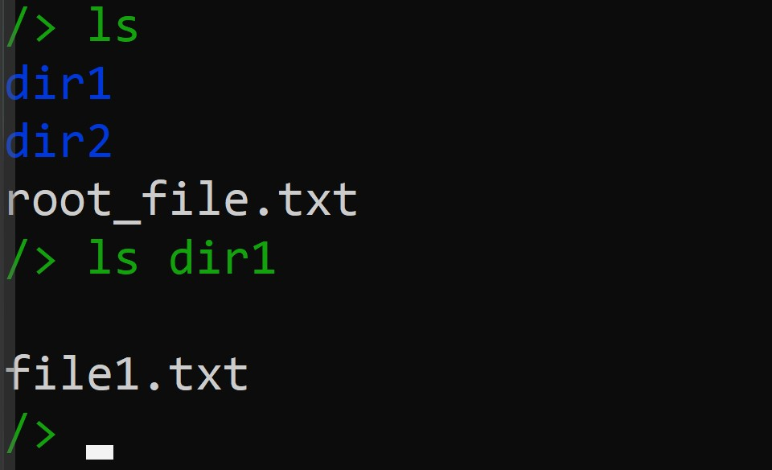
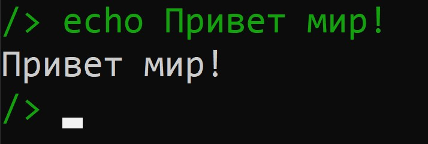
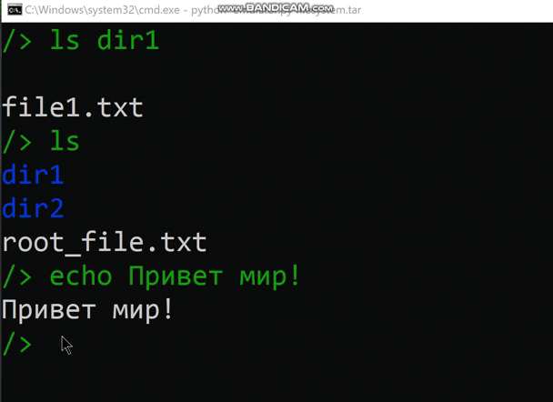
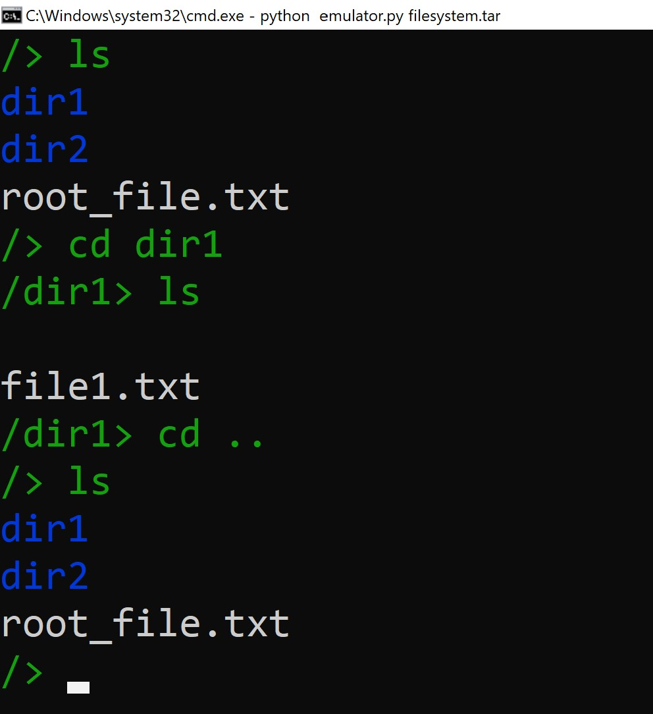
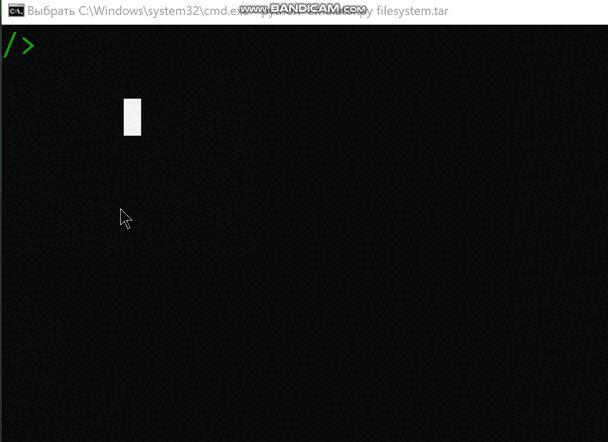

# Задание №1
---
Разработать эмулятор для языка оболочки ОС. Необходимо сделать работу эмулятора как можно более похожей на сеанс shell в UNIX-подобной ОС. Эмулятор должен запускаться из реальной командной строки, а файл с виртуальной файловой системой не нужно распаковывать у пользователя. Эмулятор принимает образ виртуальной файловой системы в виде файла формата tar. Эмулятор должен работать в режиме CLI.

Ключами командной строки задаются:
* Имя пользователя для показа в приглашении к вводу.
* Путь к архиву виртуальной файловой системы.
* Путь к стартовому скрипту.

Стартовый скрипт служит для начального выполнения заданного списка команд из файла.
Необходимо поддержать в эмуляторе команды:
1. ls - вывод каталогов и файлов в выбранном пути
2. echo - вывод введенного текста
3. clear - отчистка консоли
4. cd - перемещение по каталогам
5. exit - выход из эмулятора


Все функции эмулятора должны быть покрыты тестами, а для каждой из поддерживаемых команд необходимо написать 2 теста.

---
# Требования 
    Python 3.x
# Установка

    Скачайте или клонируйте репозиторий:

    Убедитесь, что у вас установлен Python 3.x.

--- 

# Виртуальная файловая система

Создайте архив filesystem.tar, содержащий файловую систему. К репозиторию приложен уже созданный файл с файловой системой:

```
 files (корневой каталог "/")
    dir1
        file1.txt
    dir2
        another_file.txt
    root_file.txt
```
С помощью данной файловой сисемы мы приведем тесты(раздел Запуск и тестирование).

---

# Запуск и тестирование
Переходим в каталог где скачали/склонировали репозиторий и запускаем файловую систему и файл эмулятора написанного на языке pyhon:
```
python emulator.py filesystem.tar
```

После чего попадаем в сделанный эмулятор сеанса shell 
## ls

## echo

## clear

## cd

## exit



Также можно запустить программу тестирование pytest если ввести в консоли в директории hw1 команду 
```shell
pytest -v
```


