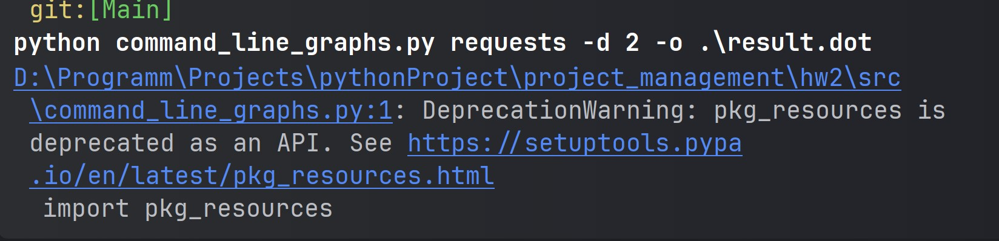

# Визуализатор графа зависимостей
---
## Постановка задачи
Разработать инструмент командной строки для визуализации графа зависимостей, включая транзитивные зависимости. Сторонние средства для получения зависимостей использовать нельзя.
Зависимости определяются по имени пакета языка Python (pip). Для описания графа зависимостей используется представление Graphviz. Визуализатор должен выводить результат на экран в виде кода.

Ключами командной строки задаются:

* Путь к программе для визуализации графов.
* Имя анализируемого пакета.
* Путь к файлу-результату в виде кода.
* Максимальная глубина анализа зависимостей.
* URL-адрес репозитория.
Все функции визуализатора зависимостей должны быть покрыты тестами.
## Требования к работе

python версии 3.x
Иметь библиотеки:
* pkg_resources
* graphviz -> Digraph
* argparse

А для теста программы иметь:
* pytest

## Установка

    Скачайте или клонируйте репозиторий:

    Убедитесь, что у вас установлен Python 3.x.

    При желании можно скачать и использовать pytest

--- 

## Запуск и тестирование
Для тестирования программы, нужно в директории src запустить скрипт
```bash
 python command_line_graphs.py requests -d 2 -o .\name_file.dot
```
При выполнении команды нам напишут предупреждение из-за библиотеки pkg_resources, так как она устарела.

После же мы можем увидеть что создался файл с расширением .dot в котором описан пакет


Также можно запустить pytest в корневой директории
```bash
pytest -v
```